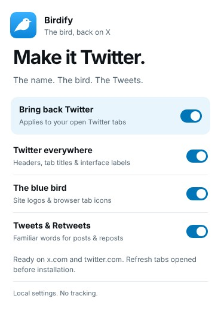

<p align="center">
  
</p>

<h1 align="center">Birdify</h1>

<p align="center">
  Bring back Twitter. The name, the bird, the Tweets.<br>
  <sub>Formerly ReTwitterify Advanced.</sub>
</p>

<p align="center">
  <a href="https://github.com/ExplodingCB/retwitterify-advanced/releases/latest"></a>
  
  
  <a href="LICENSE"></a>
</p>

<p align="center">
  
</p>

## Features

- **Twitter in the interface.** Headers, browser tab titles, navigation, dialogs,
  and supported labels use Twitter again. `Premium` becomes `Twitter Blue`,
  `X Pro` becomes `TweetDeck`, and the footer reads `Twitter, Inc.`
- **The blue bird.** Restores navigation, loading and login logos, along with
  browser tab icons. The header logo is found by where it sits on the page, so it
  is replaced even when X changes the shape of its SVG.
- **Tweets and Retweets.** Familiar wording for post/repost buttons, tabs, counts,
  menu actions and notifications, capitalized the way Twitter wrote them:
  `Show 31 Tweets`, `Quote Tweet`, `Undo Retweet`. The renamed `Chat` and `History` navigation items read
  `Messages` and `Bookmarks` again.
- **Keeps up with the page.** Watches for changes as you navigate and scroll;
  there is no polling loop constantly rescanning the site.
- **Your choice.** Separate switches for names, logos and terminology. A master
  switch pauses the extension and restores its changes in open tabs.
- **Runs locally.** No analytics, remote code, background worker, or runtime
  dependencies. Four preferences are saved in your browser.

## Install

Download the ZIP for your browser from the
[latest release](https://github.com/ExplodingCB/retwitterify-advanced/releases/latest).
You do not need Node.js to use a release build.

### Firefox

Install **Birdify** from [addons.mozilla.org](https://addons.mozilla.org/firefox/search/?q=Birdify).
Firefox keeps it up to date.

To test a release build instead:

1. Download `birdify-firefox-<version>.zip`.
2. Open `about:debugging#/runtime/this-firefox`.
3. Click **Load Temporary Add-on** and select the ZIP, or extract it and select
   `manifest.json`.
4. Refresh your open X/Twitter tabs.

Requirements: Firefox 142 or newer, on desktop.

> The release ZIPs on GitHub are unsigned, so a temporary installation lasts
> until Firefox restarts. The addons.mozilla.org version is signed.

### Chrome, Edge, Brave and Opera

1. Download and extract `birdify-chromium-<version>.zip`.
2. Open your browser's extensions page: `chrome://extensions` in Chrome or
   `edge://extensions` in Edge.
3. Enable **Developer mode**, click **Load unpacked**, and select the extracted
   folder containing `manifest.json`.
4. Refresh your open X/Twitter tabs.

Disable the original ReTwitterify extension if you have it installed, so the two
do not compete over the page. Pin **Birdify** to the toolbar to get to its
settings.

## Usage

Open X as usual. Click the extension's bird icon to choose what comes back:

| Setting | What it changes |
|---|---|
| **Bring back Twitter** | Pauses or resumes all changes |
| **Twitter everywhere** | Headers, browser tab titles, Twitter Blue, and supported interface wording |
| **The blue bird** | Recognized site logos, favicons, and touch icons |
| **Tweets & Retweets** | Post/repost terminology, plus Messages and Bookmarks in navigation |

Settings apply to open tabs with the extension loaded. Refresh tabs opened before
installation. If you disable or uninstall the extension through the browser,
refresh X to clear existing page changes.

The extension is designed to preserve tweet bodies, recognized profile/name
fields, direct messages, cards, trends, and text you are composing. Displayed URLs
and link destinations stay the same. The address bar still uses `x.com`.

## Scope and status

English interface wording is supported on `x.com` and `twitter.com`, including
their `www` and `mobile` subdomains. Other sites and embedded tweets are outside
this version's scope. Text inside images, video, or canvas is not rewritten.

The public login page's current markup was inspected in October 2026. Automated
tests cover text rules, dynamic updates, settings, restoration, and recognized
user-content boundaries. The popup screenshot above comes from the local browser
fixture. Live authenticated Firefox behavior has not yet been verified. X's
experiments and future markup changes may need additional selectors.

Found a missed label or an unwanted replacement?
[Open an issue](https://github.com/ExplodingCB/retwitterify-advanced/issues) with the
page, browser version, and a screenshot with private information removed.

---

# Technical details

## How it works

The extension uses Manifest V3 content scripts and a batched `MutationObserver`.
Inserted subtrees and changed labels are processed as they arrive. Selectors use
semantic roles, known test IDs, and recognizable logo paths rather than generated
CSS class lists.

Changes are made to individual text nodes and attributes, preserving the site's
elements and click handlers. A journal records original values. Pausing restores
only values that still match what the extension wrote, leaving newer website
changes alone. Disconnected nodes are removed from that journal.

The only API permission is `storage`, for four local boolean preferences. All code
and icons are bundled. There is no telemetry or extension-initiated network
transmission. See the [privacy policy](submission/privacy-policy.txt).

## Building and checking

Requires Node.js 22 or newer. CI uses Node.js 24.

```sh
git clone https://github.com/ExplodingCB/retwitterify-advanced.git
cd retwitterify-advanced
npm ci
npm test
npm run build
npm run lint:firefox
```

The output is `dist/firefox/`, `dist/chromium/`, and one ZIP per browser. The build
copies readable JavaScript without minification and generates the bundled icon
sizes. Firefox's manifest includes its extension ID and no-data-collection
declaration; Chromium's omits the Firefox-specific metadata.

```sh
npm run preview
```

Open `http://127.0.0.1:4173` for a local interface fixture using the real content
scripts and a storage API shim. Try the switches and **Simulate a page update** to
check dynamic labels and tab titles. This is a test fixture, not the live site.

After rebuilding, reload the extension from your browser's extensions page and
refresh X. Contributions and focused regression tests are welcome; see
[CONTRIBUTING.md](CONTRIBUTING.md).

## Releasing

Pushing a `v*` tag runs `.github/workflows/release.yml`. Running the workflow by
hand from the Actions tab does the same for the version in
`extension/manifest.json` and creates its tag; its `amo_only` option skips the
GitHub release and only submits to Mozilla. It checks the version,
tests, builds both browser packages, runs Mozilla's validator, and publishes a
GitHub release with the ZIPs, reviewer source, and `SHA256SUMS.txt`.

To prepare the same files locally:

```sh
npm run submission
```

Update both `package.json` and `extension/manifest.json`, refresh the lockfile,
`docs/RELEASE_NOTES.md` and the release notes in `submission/listing.txt`, then tag
that version.

When the `AMO_JWT_ISSUER` and `AMO_JWT_SECRET` repository secrets hold an
[addons.mozilla.org API key](https://addons.mozilla.org/developers/addon/api/key/),
the release workflow also uploads the listing icon and submits the Firefox package
to Mozilla for review. `npm run publish:amo` does the same locally with those
variables set; `node scripts/amo.js --icon-only` sets just the icon. GitHub releases do not sign Firefox
extensions. The [Mozilla submission guide](submission/SUBMIT.txt) covers that
separate step.

## Code layout

| File | Role |
|---|---|
| `extension/rules.js` | Text rules, validated defaults, tab titles, bird geometry |
| `extension/engine.js` | Scoped DOM traversal, batched updates, logos, reversible changes |
| `extension/content.js` | Browser storage integration and startup handling |
| `extension/popup.*` | Accessible settings, light/dark appearance, save-error recovery |
| `scripts/build.js` | Icons and browser packages |
| `scripts/submission.js` | Reviewer source archive and release checksums |
| `scripts/amo.js` | Listing icon upload and version submission to addons.mozilla.org |
| `tests/` | Regression tests and local visual fixture |
| `submission/` | Store listing text, privacy policy, and reviewer instructions |

## License

Free and open source under **MPL-2.0**. See [LICENSE](LICENSE).

Inspired by [Xenoreaper/ReTwitterify](https://github.com/Xenoreaper/ReTwitterify).
The replacement engine and popup are new implementations; bird geometry is adapted
from the original under MPL-2.0. Attribution is retained in
[THIRD_PARTY_NOTICES](THIRD_PARTY_NOTICES) and both browser packages.

Independent project; not affiliated with X or Twitter. Their names and branding
belong to their respective owners.
